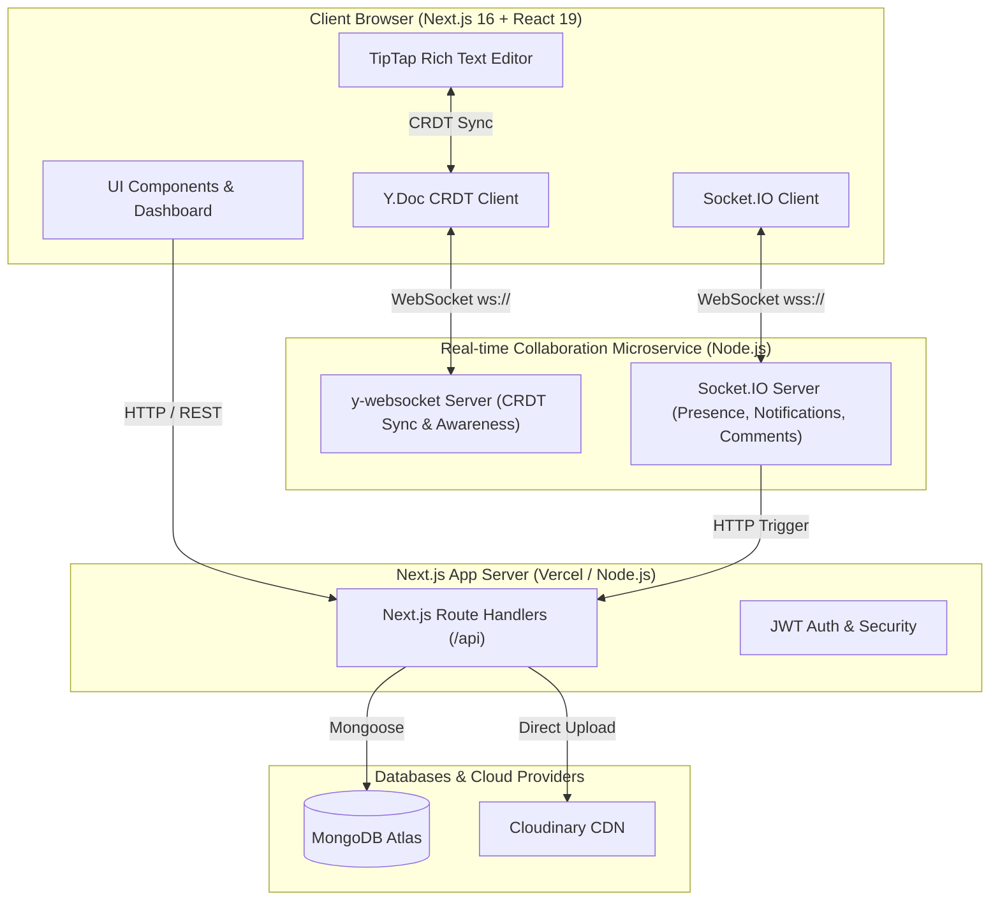

<div align="center">

# 📝 LiveDocs

### Next-Generation Real-Time Collaborative Document Workspace

[](https://nextjs.org/)
[](https://react.dev/)
[](https://www.typescriptlang.org/)
[](https://tailwindcss.com/)
[](https://yjs.dev/)
[](https://socket.io/)
[](https://www.mongodb.com/)

<br />

<p align="center">
  A full-stack, enterprise-grade collaborative document platform engineered with <strong>Next.js 16</strong>, <strong>TipTap</strong>, <strong>Yjs CRDTs</strong>, <strong>Socket.IO</strong>, and <strong>MongoDB</strong>. Experience conflict-free simultaneous editing, live multi-cursor presence, instant notifications, granular role permissions, and hierarchical folder organization.
</p>

[Live Demo](https://live-docs-produc.vercel.app) · [Report Bug](https://github.com/MOHAMED-EHAB-DEV/live-docs/issues) · [Request Feature](https://github.com/MOHAMED-EHAB-DEV/live-docs/issues)

</div>

---

## 📑 Table of Contents

- [Overview](#-overview)
- [Key Features](#-key-features)
- [System Architecture](#-system-architecture)
- [Tech Stack](#-tech-stack)
- [Project Structure](#-project-structure)
- [Getting Started](#-getting-started)
  - [Prerequisites](#prerequisites)
  - [Environment Variables](#environment-variables)
  - [Installation & Local Run](#installation--local-run)
  - [Running with Docker](#running-with-docker)
- [WebSocket & Real-time Events](#-websocket--real-time-events)
- [API Reference](#-api-reference)
- [Contributing](#-contributing)
- [License](#-license)

---

## 🌟 Overview

**LiveDocs** is designed to provide the fluid, low-latency collaboration experience of Google Docs combined with the clean, modular workspace organization of Notion. 

Unlike traditional document editors that rely on periodic auto-saving or locking mechanisms, LiveDocs implements **Conflict-free Replicated Data Types (CRDTs)** powered by **Yjs** and a dedicated **y-websocket** server. This guarantees that multi-user edits synchronize instantaneously across all connected clients with zero merge conflicts, even under unstable network conditions.

---

## ✨ Key Features

### ⚡ Real-Time Collaboration & CRDT Sync
- **Conflict-Free Real-Time Editing:** TipTap Prosemirror rich-text editor integrated with Yjs CRDTs for seamless multi-user typing.
- **Live Collaboration Cursors:** Real-time visual cursors displaying collaborator names, assigned avatar colors, and current selection ranges.
- **Active Presence Avatars:** Floating active user indicator bar showing everyone currently viewing and editing the document.
- **Live Document Title Sync:** Real-time broadcast and synchronization when document titles are updated.

### 📁 Workspace & Document Organization
- **Hierarchical Tree Structure:** Create nested folders and subfolders to organize projects and notes.
- **Document Management:** Create, duplicate, rename, move, and soft/hard delete documents with safety confirmation modals.
- **Instant Search & Filter:** Dynamic search modal to filter through folders, subfolders, and documents in milliseconds.
- **Public & Private Documents:** One-click toggle to make documents publicly accessible or private to authorized collaborators.

### 👥 Access Control & Permissions
- **Granular Roles:** Assign **Creator**, **Editor** (write & comment), and **Viewer** (read-only) permissions per document.
- **Live Collaborator Management:** Add collaborators by email, adjust their roles on the fly, or revoke access instantly.
- **Instant Notification Dispatch:** Users receive real-time push alerts via Socket.IO whenever a document is shared with them.

### 🎨 Rich Text & Media Editing Suite
- **Comprehensive Formatting:** Bold, Italic, Underline, Strike-through, Text Colors, Background Highlights, Subscript, Superscript.
- **Headings & Typography:** H1 through H6, Paragraphs, Blockquotes, Horizontal Rules, and Bullet/Ordered/Task Lists.
- **Custom Syntax-Highlighted Code Blocks:** Integrated with `lowlight` for multi-language code snippets with copy-to-clipboard functionality.
- **Media Uploads:** Cloudinary-backed inline image uploads with custom alignment and responsive sizing.
- **Text Alignment & Direction:** Full Left, Center, Right, and Justified alignment support.

### 💬 In-App Commenting & Notifications
- **Document Comment Threads:** Post, reply, and delete comments with instant real-time broadcast to all active room members.
- **Notification Drawer:** Real-time notification center tracking document shares, role updates, and user mentions.

### 🔒 Security & Authentication
- **Secure Authentication:** Custom JWT-based stateless authentication flow with bcrypt password encryption.
- **Profile & Security Center:** Update user profile avatars, manage account details, change passwords, and securely log out.

---

## 🏗️ System Architecture



---

## 🛠️ Tech Stack

| Domain | Technology | Description |
|---|---|---|
| **Frontend Framework** | [Next.js 16 (App Router)](https://nextjs.org/) | Hybrid React framework with Server Actions and Route Handlers |
| **UI & Styling** | [React 19](https://react.dev/), [Tailwind CSS v4](https://tailwindcss.com/), [Radix UI](https://www.radix-ui.com/) | Modern design system, responsive layouts, accessible primitives |
| **Rich Text Editor** | [TipTap 3](https://tiptap.dev/) & [ProseMirror](https://prosemirror.net/) | Headless, extensible rich-text editing engine |
| **CRDT Synchronization** | [Yjs](https://yjs.dev/), [y-websocket](https://github.com/yjs/y-websocket), [y-prosemirror](https://github.com/yjs/y-prosemirror) | Real-time conflict-free collaborative data synchronization |
| **Live Events & Presence** | [Socket.IO](https://socket.io/) (v4) | Bi-directional event broadcasting for active users and notifications |
| **Realtime Backend** | Node.js, Express, `ws` | Dedicated collaboration and WebSocket service |
| **Database & ODM** | [MongoDB Atlas](https://www.mongodb.com/), [Mongoose 9](https://mongoosejs.com/) | Document-oriented NoSQL storage |
| **Media Management** | [Cloudinary SDK](https://cloudinary.com/) | Cloud storage and optimization for user images and attachments |
| **Validation & Auth** | [Valibot](https://valibot.dev/), [JSONWebToken](https://github.com/auth0/node-jsonwebtoken), [bcryptjs](https://github.com/dcodeIO/bcrypt.js) | Type-safe schema validation and cryptographic security |
| **DevOps & Containers** | [Docker](https://www.docker.com/), Docker Compose | Production-ready containerized microservices |

---

## 📂 Project Structure

```text
live-docs/
├── app/                        # Next.js App Router root
│   ├── (auth)/                 # Authentication routes (Sign-in, Sign-up)
│   ├── (root)/                 # Authenticated application workspace
│   │   ├── dashboard/          # Main dashboard & workspace overview
│   │   ├── documents/          # Collaborative document editor pages
│   │   └── settings/           # User profile & security settings
│   ├── api/                    # Backend REST API route handlers
│   │   ├── auth/               # Login, register, logout, session endpoints
│   │   ├── documents/          # Document CRUD, sharing, permissions
│   │   ├── folders/            # Folder & subfolder hierarchy APIs
│   │   ├── notifications/      # Real-time user alert endpoints
│   │   ├── upload/             # Cloudinary upload handler
│   │   └── users/              # User queries and updates
│   ├── globals.css             # Tailwind CSS tokens & base styles
│   └── layout.tsx              # Root HTML layout & Provider wrappers
├── components/                 # Reusable React components
│   ├── editor/                 # TipTap editor, collaboration cursors, toolbar
│   ├── ui/                     # Shadcn / Radix UI primitive components
│   ├── CollaborativeRoom.tsx   # Live room provider and canvas orchestrator
│   ├── DocumentActions.tsx     # Rename, duplicate, delete document modal
│   ├── FolderActions.tsx       # Folder management actions and dialogues
│   ├── Notifications.tsx       # Real-time bell notification drawer
│   └── ShareModel.tsx          # Collaborator invite & role management modal
├── context/                    # React Context providers (Auth, Socket, Room)
├── hooks/                      # Custom React hooks
├── lib/                        # Server utilities, DB connection, models
│   ├── models/                 # Mongoose schemas (Document, Folder, User, etc.)
│   ├── cloudinary.ts           # Cloudinary SDK client configuration
│   ├── database.ts             # Cached MongoDB connection utility
│   └── validations.ts          # Valibot schemas for API requests
├── server/                     # Standalone real-time collaboration server
│   ├── Dockerfile              # Dockerfile for real-time WebSocket backend
│   ├── docker-compose.yml      # Multi-container composition
│   └── index.js                # Express + Socket.IO + Y-Websocket server
└── types/                      # Global TypeScript definitions
```

---

## 🚀 Getting Started

### Prerequisites

Make sure you have the following installed on your machine:
- **Node.js** >= 20.x
- **npm** or **bun** or **yarn**
- **MongoDB** instance (Local or [MongoDB Atlas](https://www.mongodb.com/atlas))
- **Cloudinary** account for image hosting

---

### Environment Variables

Create a `.env` file in the project root with the following keys:

```env
# Database
MONGODB_URI=mongodb+srv://<username>:<password>@cluster.mongodb.net/livedocs?retryWrites=true&w=majority

# Authentication
JWT_SECRET=your_super_secret_jwt_key_here

# App URLs
NEXT_PUBLIC_BASE_URL=http://localhost:3000
NEXT_PUBLIC_SOCKET_SERVER_URL=http://localhost:3001

# Cloudinary Storage
CLOUDINARY_CLOUD_NAME=your_cloudinary_cloud_name
CLOUDINARY_API_KEY=your_cloudinary_api_key
CLOUDINARY_API_SECRET=your_cloudinary_api_secret
```

For the real-time server (`/server`), optionally create `server/.env`:
```env
PORT=3001
NODE_ENV=development
```

---

### Installation & Local Run

#### 1. Clone the repository
```bash
git clone https://github.com/MOHAMED-EHAB-DEV/live-docs.git
cd live-docs
```

#### 2. Install dependencies
```bash
npm install
```

#### 3. Run the Next.js Frontend Application
```bash
npm run dev
```
The client app will be accessible at [http://localhost:3000](http://localhost:3000).

#### 4. Run the Real-Time Collaboration Server
In a separate terminal window:
```bash
cd server
npm install
npm start
```
The collaboration server will start on [http://localhost:3001](http://localhost:3001) handling Socket.IO events and raw Y-Websocket connections.

---

### 🐳 Running with Docker

You can run the real-time collaboration backend using Docker:

```bash
cd server
docker build -t livedocs-collab-server .
docker run -p 3001:3001 --env-file ../.env livedocs-collab-server
```

Or using Docker Compose:
```bash
cd server
docker compose up -d
```

---

## ⚡ WebSocket & Real-time Events

The collaboration server listens on port `3001` and manages two channels:

| Channel / Event | Direction | Description |
|---|---|---|
| `ws://host/` | Bi-directional | Raw WebSocket upgrade for **Yjs CRDT Document Synchronization** |
| `register_user` | Client ➔ Server | Registers user email to their personal notification socket room |
| `join_document` | Client ➔ Server | Joins a document room; broadcasts updated active collaborator list |
| `leave_document` | Client ➔ Server | Leaves a document room; broadcasts exit to remaining peers |
| `active_users` | Server ➔ Client | Emits the complete list of active viewers and editors in the room |
| `update_title` | Client ➔ Server | Broadcasts instantaneous document title changes to room peers |
| `add_comment` | Client ➔ Server | Broadcasts new comments to all participants in real time |
| `delete_comment`| Client ➔ Server | Emits real-time comment deletion updates |
| `new_notification`| Server ➔ Client | Delivers private notifications (e.g. document share invite) |

---

## 🔌 API Reference

### Auth Endpoints
- `POST /api/auth/signup` - Register a new user account
- `POST /api/auth/signin` - Authenticate user credentials and issue JWT
- `POST /api/auth/logout` - Invalidate user session cookie

### Document Endpoints
- `GET /api/documents` - Fetch all documents accessible by current user
- `POST /api/documents` - Create a new document in root or specified folder
- `GET /api/documents/[id]` - Fetch document details and metadata
- `PUT /api/documents/[id]` - Update document title, content, or visibility
- `DELETE /api/documents/[id]` - Delete a document
- `POST /api/documents/[id]/share` - Update collaborator permissions & send invites

### Folder Endpoints
- `GET /api/folders` - Retrieve nested folder and subfolder directory tree
- `POST /api/folders` - Create a new top-level folder or subfolder
- `PUT /api/folders/[id]` - Rename or relocate a folder
- `DELETE /api/folders/[id]` - Delete a folder and handle contained documents

### Media & Uploads
- `POST /api/upload` - Securely upload images to Cloudinary for inline editor insertion

---

## 🤝 Contributing

Contributions make the open-source community an amazing place to learn, inspire, and create. Any contributions you make are **greatly appreciated**.

1. Fork the Project
2. Create your Feature Branch (`git checkout -b feature/AmazingFeature`)
3. Commit your Changes (`git commit -m 'Add some AmazingFeature'`)
4. Push to the Branch (`git push origin feature/AmazingFeature`)
5. Open a Pull Request

---

## 📄 License

Distributed under the **MIT License**. See `LICENSE` for more information.

<br />

<div align="center">
  <sub>Built with ❤️ by <a href="https://github.com/MOHAMED-EHAB-DEV">Mohamed Ehab</a></sub>
</div>
